<div align="center">
  

# DevKit Toolbox

**A Chrome side-panel companion for developers and QA engineers.**
Eleven utilities you reach for every day — JSON, JWT, regex, hashes, color picker,
screenshots and more — bundled into one extension and running entirely on your device.

<em>Offline by design · no telemetry · no uploads</em>

</div>

---

## Featured demo

The JSON formatter is the most-used utility in the toolbox. Paste, format,
query with JSONPath, copy — all without leaving the side panel.



> The clip above is an animated SVG; static-image viewers will see the
> final formatted state. Per-tool GIF clips will land in `docs/media/` —
> see [the recording guide](docs/media/RECORDING.md) if you want to
> contribute.

## Features

<table>
<tr>
<td width="50%" valign="top">

### 🧾 Encoders & decoders

- **JSON Formatter** — format, minify, validate, query with JSONPath
- **JWT Decoder** — inspect headers, claims, expiration
- **Base64 / URL** — round-trip text safely (UTF-8 aware)
- **Unix Timestamp** — convert with timezone + relative time
- **Hash Calculator** — MD5, SHA-1, SHA-256, SHA-512 (text or file)

</td>
<td width="50%" valign="top">

### 🛠️ Builders & testers

- **UUID Generator** — v4, v7 (sortable), NIL, bulk output
- **Regex Tester** — live highlighting, capture groups, cheatsheet
- **Text Diff** — side-by-side / unified, ignore whitespace or case

</td>
</tr>
<tr>
<td width="50%" valign="top">

### 🎨 Design

- **Color Picker** — native screen eyedropper, HEX / RGB / HSL / CMYK, palette history

</td>
<td width="50%" valign="top">

### 🧪 QA helpers

- **Clipboard History** — searchable, pinned items survive cleanup
- **Screenshot + Annotations** — capture the active tab, draw rectangles, arrows, text

</td>
</tr>
</table>

**Languages:** English · Deutsch · Français · Español · Русский · Italiano
&nbsp;&nbsp;**Themes:** light · dark · system

## Quick start

```bash
git clone https://github.com/<you>/devkit-toolbox.git
cd devkit-toolbox
npm install
npm run build
```

Then load the unpacked extension:

1. Open `chrome://extensions`
2. Toggle **Developer mode** (top-right)
3. Click **Load unpacked** and select the `dist/` folder
4. Click the DevKit Toolbox icon in the toolbar — the side panel opens

A four-step onboarding tour runs on first launch.

## Privacy

DevKit Toolbox is **fully offline**. It never makes network requests, never
collects telemetry, never uploads files. Settings and history live in
`chrome.storage.local` and never leave your browser.

| Permission                         | Why it's needed                                                   |
| ---------------------------------- | ----------------------------------------------------------------- |
| `storage`                          | Persist your theme, language and tool history locally             |
| `sidePanel`                        | Render the toolbox in Chrome's side panel                         |
| `activeTab` + `scripting`          | Take screenshots and capture clipboard data when you trigger them |
| `clipboardRead` / `clipboardWrite` | Clipboard history and one-click "Copy" buttons                    |

No `<all_urls>` host permissions. No analytics endpoints. The `install_id`
generated on first run lives only in your local storage; we don't have it.

## Development

```bash
npm run dev          # Vite dev server (browser-only iteration)
npm run build        # Production bundle into dist/
npm run typecheck    # tsc -b --noEmit
npm run lint         # ESLint (warnings treated as errors)
npm run test         # Vitest one-shot
npm run i18n:check   # Verify locale key consistency
npm run zip          # Pack dist/ into dist-zip/devkit-toolbox.zip
```

Pre-commit runs `lint-staged` (ESLint + Prettier on staged files).
CI runs lint → typecheck → i18n check → tests → build on every push and PR.
Pushing a tag `v*.*.*` produces a GitHub Release with the packaged ZIP.

## Project structure

```
src/
├── background/      Service worker (side panel open, screenshot, install meta)
├── sidepanel/       App, Home, Settings, Tool, Onboarding screens
├── components/      Layout, ThemeProvider, ThemeToggle, LanguageSelector, ui/*
├── tools/           One folder per utility + registry.tsx
├── storage/         chrome.storage wrapper, Zustand store, backup, telemetry
├── i18n/            react-i18next setup + locales/{en,de,fr,es,ru,it}/
├── lib/             cn(), license placeholder, shared helpers
└── styles/          globals.css with Tailwind layers and theme tokens

public/
├── _locales/        Chrome Web Store-facing localised name/description
└── icons/           Extension icons (16/32/48/128)

scripts/
├── generate_icons.py   Regenerate icons from the geometric source
├── icon-source.svg     Vector reference for the icon design
└── check-i18n.mjs      CI check for missing/extra locale keys
```

Adding a new tool? See the recipe in [CLAUDE.md](./CLAUDE.md).

## Roadmap

- ✅ Phases 0–1: bootstrap, app shell, i18n, theming
- ✅ Phase 2: 11 MVP utilities, 129 unit tests
- 🛠️ Phase 3 (current): icons, onboarding, settings export, telemetry, translations, landing
- 🔮 Phase 4: Pro features (header overrides, mock API, team templates) once monetisation lands

See [TASKS.md](./TASKS.md) for the full task list and status.

## Contributing

Bug reports, ideas and PRs are welcome via GitHub Issues. For translations,
native-speaker review of `src/i18n/locales/<lang>/*.json` is especially
appreciated.

## License

TBD before first public release.
